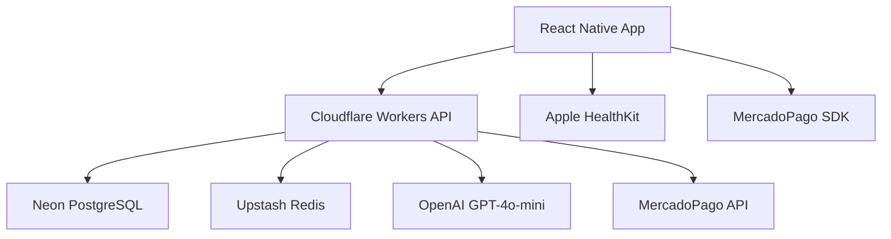

# FitAI - Entrenamiento Inteligente con IA

<div align="center">
  
  
  [](https://developer.apple.com/ios/)
  [](https://reactnative.dev/)
  [](https://expo.dev/)
  [](https://www.typescriptlang.org/)
  [](https://workers.cloudflare.com/)
</div>

## 🚀 Descripción del Proyecto

FitAI es la primera aplicación de fitness con inteligencia artificial diseñada específicamente para el mercado chileno. Combina tecnología de punta con un profundo entendimiento de las necesidades locales para ofrecer una experiencia de entrenamiento personalizada e inteligente.

### ✨ Características Principales

- 🤖 **IA Personalizada**: Rutinas generadas por GPT-4o-mini adaptadas a tu nivel
- 📊 **Análisis Avanzado**: Dashboard con métricas de rendimiento y progreso
- ⌚ **Apple Watch**: Integración completa con seguimiento en tiempo real
- 👥 **Comunidad Social**: Comparte rutinas, logros y desafíos
- 💰 **Pagos Locales**: Integración nativa con MercadoPago Chile
- 📱 **Offline Ready**: Funciona sin conexión para entrenamientos
- 🇨🇱 **Hecho para Chile**: Precios en CLP y soporte en español chileno

## 🏗️ Arquitectura Técnica



### Stack Tecnológico

**Frontend**
- React Native con Expo SDK 53
- New Architecture (Bridgeless Mode)
- TypeScript para type safety
- Expo Router para navegación
- Zustand para state management

**Backend**
- Cloudflare Workers (Edge Computing)
- Hono.js (Lightweight API Framework)
- TypeScript end-to-end
- JWT Authentication

**Base de Datos**
- Neon PostgreSQL (Serverless)
- Upstash Redis (Caching)
- Prisma como ORM (opcional)

**Integraciones**
- OpenAI GPT-4o-mini para IA
- MercadoPago para pagos
- Apple HealthKit para datos de salud
- Apple Watch para tracking

## 📂 Estructura del Proyecto

```
FitAI/
├── apps/
│   ├── mobile/           # React Native App
│   │   ├── app/         # Expo Router pages
│   │   ├── src/         # Components y utilidades
│   │   └── assets/      # Imágenes e iconos
│   ├── api/             # Cloudflare Workers Backend
│   │   ├── src/         # API routes y lógica
│   │   └── wrangler.toml # Configuración Cloudflare
│   └── web/             # Admin Panel (futuro)
├── packages/            # Código compartido
├── docs/               # Documentación completa
│   ├── app-store/      # Assets para App Store
│   ├── DEPLOYMENT_GUIDE.md
│   ├── IMPLEMENTATION_PLAN.md
│   ├── PROJECT_SUMMARY.md
│   └── LAUNCH_READINESS.md
└── README.md           # Este archivo
```

## 🚀 Inicio Rápido

### Prerrequisitos
- Node.js 18+
- Expo CLI
- Cuenta Cloudflare (Workers)
- Cuenta Neon (PostgreSQL)
- Cuenta OpenAI (IA)

### Instalación

```bash
# Clonar repositorio
git clone <repository-url>
cd FitAI

# Instalar dependencias
npm install

# Configurar variables de entorno
cp apps/mobile/.env.example apps/mobile/.env.local
cp apps/api/.env.example apps/api/.env.local
```

### Desarrollo Local

```bash
# Terminal 1: Iniciar backend
cd apps/api
wrangler dev

# Terminal 2: Iniciar app móvil
cd apps/mobile
npx expo start
```

## 📖 Documentación Completa

| Documento | Descripción |
|-----------|-------------|
| **[🚀 Deployment Guide](./docs/DEPLOYMENT_GUIDE.md)** | Guía completa de configuración y despliegue |
| **[📋 Implementation Plan](./docs/IMPLEMENTATION_PLAN.md)** | Plan detallado de implementación por fases |
| **[📊 Project Summary](./docs/PROJECT_SUMMARY.md)** | Resumen ejecutivo del proyecto |
| **[🎯 Launch Readiness](./docs/LAUNCH_READINESS.md)** | Preparación para el lanzamiento |
| **[📱 App Store Assets](./docs/app-store/)** | Recursos para publicación en App Store |

## 💰 Modelo de Negocio

### Planes de Suscripción (Chile)

| Plan | Precio | Características |
|------|--------|-----------------|
| **Gratuito** | $0 | • Workout logging básico<br>• 1 rutina IA/mes<br>• Progreso limitado |
| **Premium** | $7.990 CLP/mes | • 10 rutinas IA/mes<br>• Análisis avanzado<br>• Apple Watch completo |
| **Pro** | $14.990 CLP/mes | • Rutinas IA ilimitadas<br>• Análisis predictivo<br>• Soporte prioritario |

### Proyección de Ingresos (Año 1)
- **Meta**: 25,000 usuarios activos mensuales
- **Conversión**: 15% a planes premium
- **ARR Target**: $500K USD

## 🎯 Roadmap

### Phase 1: MVP Launch (Completado ✅)
- Sistema de autenticación
- Generación de rutinas con IA
- Workout logger completo
- Integración Apple Watch
- Pagos con MercadoPago

### Phase 2: Community & Analytics (Completado ✅)
- Funciones sociales
- Dashboard de análisis
- Sistema de logros
- Detección de plateau

### Phase 3: Market Expansion (Q2 2025)
- Expansión a Argentina, Colombia
- App para Android
- Integración con más wearables

### Phase 4: Advanced Features (Q3 2025)
- Análisis de forma con IA
- Recomendaciones nutricionales
- Coaching virtual por voz

## 👥 Equipo

- **Product Manager**: Responsable de visión y estrategia
- **Tech Lead**: Arquitectura y desarrollo backend
- **Mobile Developer**: React Native y experiencia móvil
- **UI/UX Designer**: Diseño centrado en usuario
- **Data Scientist**: IA y análisis de datos
- **Marketing Lead**: Estrategia de crecimiento

## 🤝 Contribución

### Para Desarrolladores

```bash
# Fork del repositorio
git fork <repository-url>

# Crear branch para feature
git checkout -b feature/nueva-funcionalidad

# Hacer cambios y commit
git commit -m "feat: agregar nueva funcionalidad"

# Push y crear PR
git push origin feature/nueva-funcionalidad
```

### Guidelines
- Usar TypeScript estricto
- Seguir convenciones de naming
- Escribir tests para nuevas features
- Documentar APIs y componentes
- Usar commits semánticos (feat, fix, docs, etc.)

## 📄 Licencia

Copyright © 2025 FitAI Technologies SpA. Todos los derechos reservados.

Este proyecto es software propietario. No está permitida la distribución, modificación o uso comercial sin autorización explícita.

## 📞 Contacto y Soporte

- **Website**: https://fitai.cl
- **Email**: hola@fitai.cl
- **Soporte**: soporte@fitai.cl
- **Legal**: legal@fitai.cl

### Redes Sociales
- **Instagram**: [@fitai.cl](https://instagram.com/fitai.cl)
- **TikTok**: [@fitai.cl](https://tiktok.com/@fitai.cl)
- **LinkedIn**: [FitAI Chile](https://linkedin.com/company/fitai-chile)

---

<div align="center">
  <strong>🇨🇱 Hecho con ❤️ en Chile para el mundo</strong><br>
  <em>Revolucionando el fitness con inteligencia artificial</em>
</div>

---

## 📈 Status del Proyecto

**Estado Actual**: ✅ **COMPLETADO Y LISTO PARA LANZAMIENTO**

- ✅ Desarrollo completado (6 fases)
- ✅ Testing integral realizado
- ✅ Documentación completa
- ✅ App Store assets preparados
- ✅ Compliance y legal completado
- ✅ Infraestructura lista para producción

**Próximo paso**: Submisión a App Store y lanzamiento en Chile 🚀